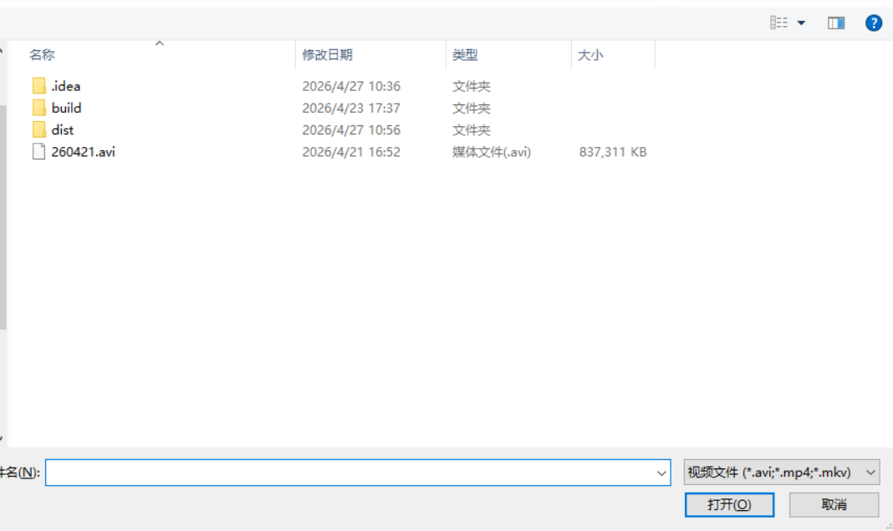
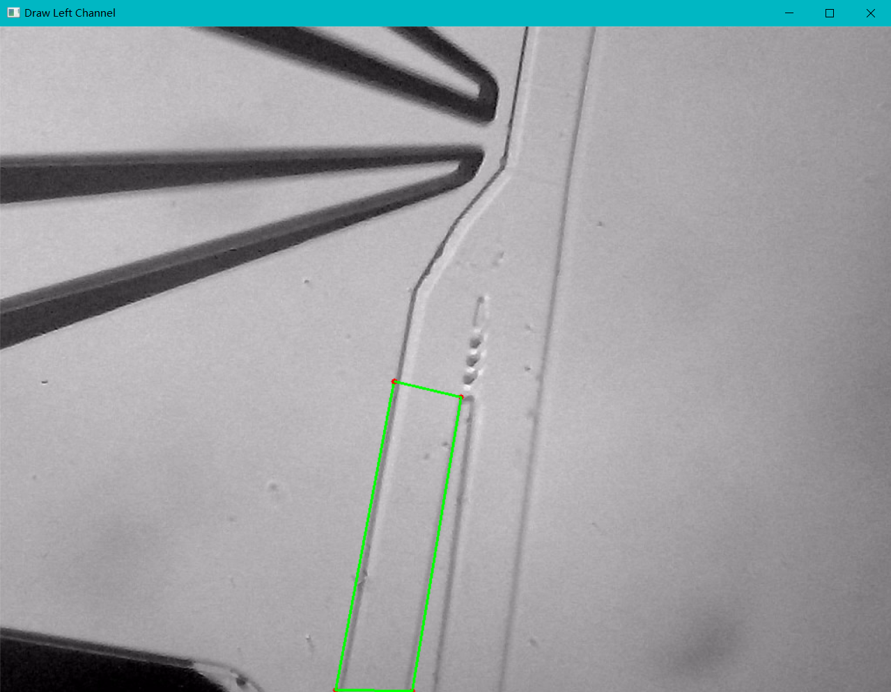
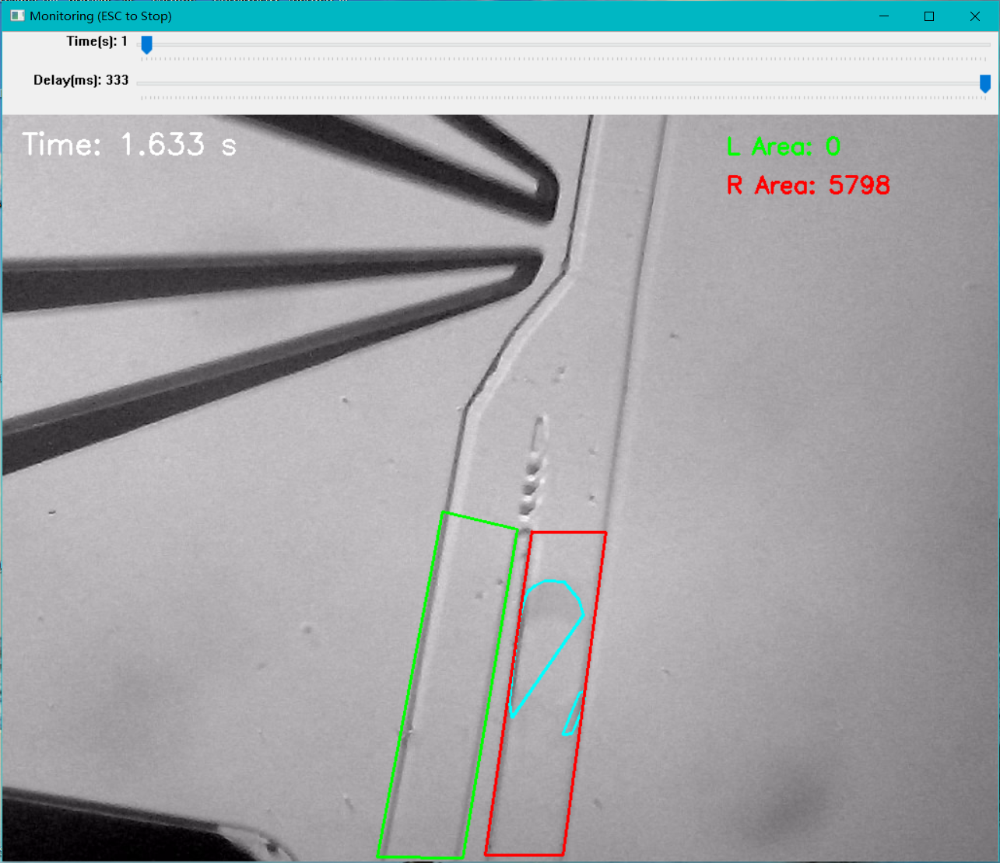

# 🔬 Microfluidic Droplet & Bubble Tracker / 微流控液滴与气泡动态追踪器

[**English**](#english-version) | [**中文版**](#中文版)

---

<h2 id="中文版">🇨🇳 中文版</h2>

### 📖 简介
这是一个基于计算机视觉的高效轻量级视频分析工具。主要用于**统计视频中流过不同微流控通道的液滴或气泡数量**。该工具不仅具有高精度的识别能力，还内置了智能抗干扰算法，适用于各类复杂的显微镜观测和实验记录场景。

### ✨ 核心特性
* **🎯 多通道独立统计：** 可以同时设定左侧和右侧两个不同的通道，独立记录液滴经过的时间点与数量。
* **📐 自由绘制不规则边界 (ROI)：** 告别死板的矩形框！支持通过鼠标连线绘制任意多边形检测边界。无论微流控通道是倾斜的还是弯曲的，都能完美贴合，适应不同的实验环境。
* **🛡️ 智能过滤与精准计数 (抗干扰)：** * **面积阈值过滤：** 底层算法默认仅统计边界内面积**大于 2000 像素点**的物体。这一设计能完美去除微小液滴、碎小气泡以及水流扰动造成的视觉干扰。
    * **唯一计数逻辑：** 无论大液滴被拉得有多长、流速有多慢，状态机算法确保**一个液滴只会被统计一次**，并精准抓取其通过时的“最大峰值面积”。

### 📸 操作演示 (Visual Demos)

1. **导入视频：** 运行程序后，会弹出直观的文件选择界面，支持加载本地的实验视频。

*(说明：请将您选择视频的截图命名为 `1_select_video.png` 并放在仓库的 `docs/images/` 目录下)*

2. **自由绘制检测边界：** 通过鼠标依次点击通道边缘，精准圈定您感兴趣的识别区域。

*(说明：请将您正在画绿色/红色边框的截图命名为 `2_draw_roi.png` 替换此处)*

3. **实时识别过程可视化：** 算法运行中，原图将实时绘制检测到的气泡真实轮廓（黄色/青色），并在控制台同步输出检测数据。

*(说明：请将带有内部黑白掩码窗口、主画面带轮廓线的截图命名为 `3_tracking_process.png` 替换此处)*

### 🚀 如何使用
**方式一：直接运行独立版 (推荐 Windows 用户)**
无需配置任何 Python 环境，直接在 [Releases](https://github.com/YourUsername/YourRepoName/releases) 页面下载 `bubble_analyzer.exe`，双击运行即可。

**方式二：通过 Python 源码运行**
```bash
pip install opencv-python numpy
python bubble_analyzer.py
